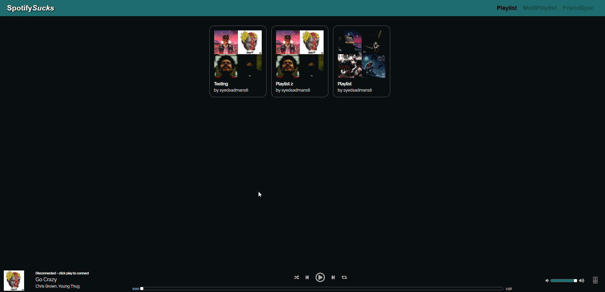
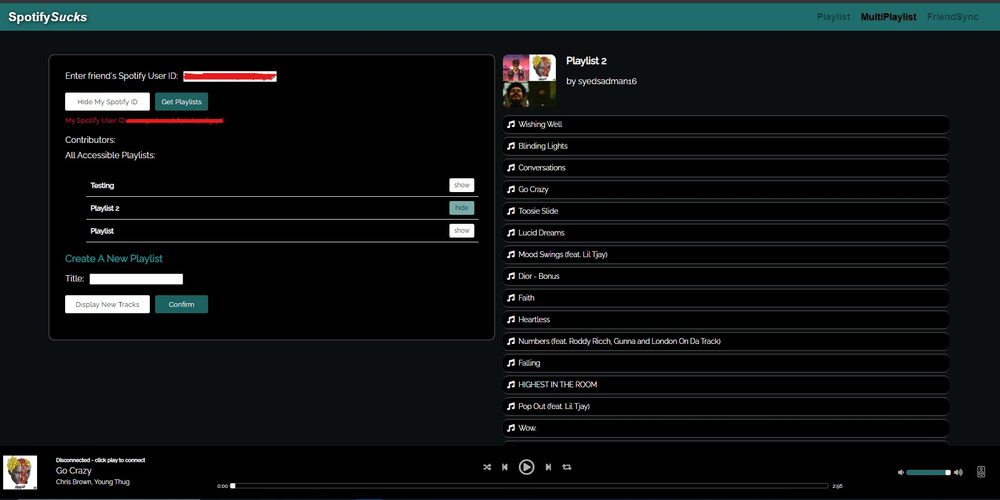

# Spotify Sucks
HYO Team Scorpius recreating a Spotify Web Player with improved features. This includes a new playlist shuffer, the ability to create multiplaylists, and synchronizing songs with friends via friendsync

**Note:** *A spotify premium account is needed to play songs with the built in media player*

## Screenshots
Quick Demo
***

<br />
<br />

Multiplaylist:
*Generates a new playlist based on unique tracks from several playlists*
***
 
<br />
<br />

# BUILDING

## Requirements
- [Node version 12.18.0](https://nodejs.org/en/)
   - If you're on Unix/macOS/WSL, consider using [nvm](https://github.com/nvm-sh/nvm#about) to install instead.

## Setup

1. Hit the *Fork* button in the top right corner to fork the repository to your GitHub.

2. Clone the resulting repository.
```
git clone  <repo-url>
```

3. Enter the cloned repository and install dependencies.
```
cd SpotifySucks
npm install && cd backend && npm install && cd ../frontend && npm install 
```
4. Setup the following:
   ### Environment Variables
      - [create a spotify application](https://developer.spotify.com/my-applications/)
      - create a file in the backend/ folder called .env
      - add the following to your .env file
      - ``` 
        SPOTIFY_CLIENT_ID=<CLIENT_ID>
        SPOTIFY_CLIENT_SECRET=<CLIENT_SECRET>
        ```
     
      - create a file in the frontend/ folder called .env
      - add the following to your .env file
      - ```
         REACT_APP_API_URL=http://localhost:1337 
         ```  

5. Start a development server to see your changes rendered live as you make them.
```
npm run dev
```

6. View the rendered content at [http://localhost:3000](http://localhost:3000).  

# Notes

### Database Setup
  - [create mongodb atlas cluster](https://www.mongodb.com/cloud/atlas?utm_campaign=atlas_bc_mern&utm_source=medium&utm_medium=inf&utm_term=campaign_term&utm_content=campaign_content)

  - add the following to your .env file
      - ``` 
        ATLAS_URI=<DB_URI>
        ```

 - The <DB_URI> looks something like this: ```mongodb+srv://username:```<password>```@cluster.gcp.mongodb.net/test?retryWrites=true```
      - Replace ```<password>``` with the password set when creating the user in the Database Setup

 - Create ```New Project``` >> ```Build a cluster``` 
      - Go to the ```Database``` tab under 'Security' and ```Add a new database user``` with a desired password.
      - Next, go to ```Network Access``` >> ```Add an IP Address``` There should be a button where you can automatically retrieve your IP. 
      -  After the following steps, go back to ```Clusters``` and click ```Connect``` >> ```Connect your Application``` >> ```Copy```
        - This retrieves the database URI. It is used in the .env above to connect to the database.

      (Note: Under 'Collections' in the Clusters tab, you can view the data saved.)
